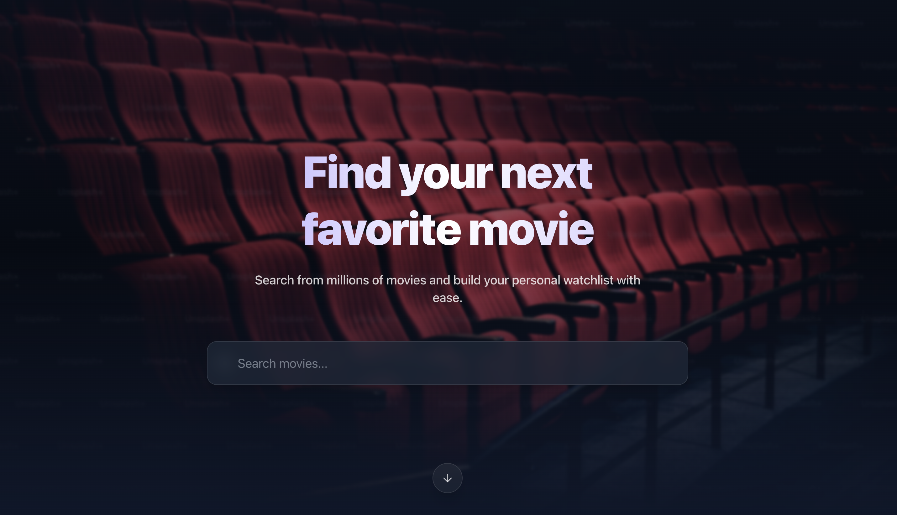
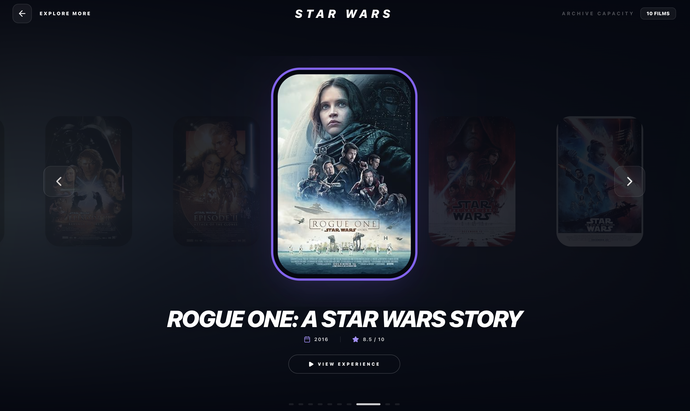

# FlickPicks - Movie Watchlist App 🎬

A beautiful, functional, and highly interactive prototype built for Mr. Anthony Russo to search for movies, view details, and save favorites to a personal watchlist.

## 🌟 Demo Video
[Insert Google Drive Link Here]

## ✨ Features
- **User Authentication**: Mock login implementation (any email/password works). Session is saved safely in `localStorage`.
- **Movie Search**: Instantly search movies from the OMDb API with elegant loading states and graceful error handling. 
- **Movie Details**: View comprehensive details including Synopsis, Director, Cast, Runtime, Genre, and more. 
- **Watchlist**: Persisted watchlist (per user/session). Users can add and remove movies effortlessly from anywhere.
- **Premium Design & Interactivity**: Built with a sleek dark aesthetic, dynamic glassmorphism UI cards, hover animations, layout transitions (using `framer-motion`), and responsive design for all device types.

## 📸 Screenshots
<div align="center">
  
  
</div>

## 🛠️ Tech Stack
- **React (Vite Base)**: Fast tooling with great developer experience.
- **TypeScript**: Strict typing for predictable behavior.
- **Tailwind CSS (v4)**: Modern utility-first CSS framework for rapid UI building.
- **Framer Motion**: State-of-the-art animations to create a highly polished experience.
- **Lucide React**: Scalable SVG icons perfectly suited for modern aesthetics.
- **React Router**: Client-side routing for seamless page transitions.

## 🚀 Getting Started

### 1. Requirements
- Node.js installed on your system (v18+ recommended)
- A terminal of your choice

### 2. Installation
Clone the repository, navigate into the project folder, and install dependencies:
```bash
# Install dependencies
npm install
```

### 3. API Key Setup
If you exceed rate limits with the default OMDb test key (`trilogy`), you can provide your own. Create a file named `.env.local` in the root of the project:
```env
VITE_OMDB_API_KEY=your_cool_key_here
```

### 4. Running the Development Server
```bash
npm run dev
```

Visit the displayed localhost URL (e.g. `http://localhost:5173`) in your favorite modern browser.

### 5. Build for Production
```bash
npm run build
npm run preview
```

## 🏗️ Architecture & Documentation
- **`/src/lib/api.ts`**: Contains OMDb fetch requests with strongly typed responses.
- **`/src/store/index.tsx`**: Uses React Context + `localStorage` to manage User state and Watchlists per user logic.
- **`/src/components/ui/`**: Reusable micro-components like `MovieCard.tsx` with interactions.
- **`/src/pages/`**: Search, Login, Watchlist, and Movie Details views dynamically rendered using `react-router-dom`.

*Enjoy exploring movies with FlickPicks!*
